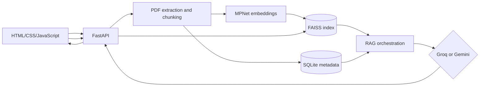

# HR Policy Assistant

A portfolio-ready RAG application that turns uploaded HR policy PDFs into a conversational knowledge base. It combines local semantic retrieval with Groq or Gemini and returns page-level evidence for every grounded answer.

## Architecture



## Capabilities

- Secure PDF upload, validation, extraction, chunking, status, and deletion
- SQLite persistence for documents, chunks, conversations, messages, and citations
- Lazy-loaded local MPNet embeddings
- Persistent FAISS cosine-similarity search and index versioning
- Separate Groq and Gemini adapters behind one provider contract
- Conversation-specific history and follow-up question rewriting
- Answers with model-declared, server-verified source chunks
- Responsive HTML/CSS/JavaScript document and chat interface
- Health, readiness, provider, document, search, conversation, and chat APIs

This remains a single-user localhost MVP. It has no authentication or document-level authorization. Read [the security boundary](docs/SECURITY.md) before considering shared deployment.

## Reproducible demo

Four clearly labelled, fictional HR policies are included in [`output/pdf`](output/pdf). Upload all four, wait until each shows `ready`, then try:

- How many paid leave days are available?
- When is salary credited?
- Who can receive a referral reward?
- What notice period applies to Level 3?
- Follow-up: Can that be waived?

The complete recording walkthrough and a suggested LinkedIn caption are in [the demo script](docs/DEMO_SCRIPT.md).

## Requirements and setup

Use Python 3.11–3.13; Python 3.12 is recommended. Python 3.14 is excluded because the ML and FAISS ecosystem may not yet provide consistently compatible builds.

```bash
python3.12 -m venv .venv
source .venv/bin/activate
python -m pip install --upgrade pip
python -m pip install -e ".[dev]"
cp .env.example .env
```

Add at least one provider key to `.env`:

```dotenv
LLM_PROVIDER=groq
GROQ_API_KEY=your-key

# Or select Gemini:
# LLM_PROVIDER=gemini
# GEMINI_API_KEY=your-key
```

Never commit `.env`. Company approval is required before sending internal policies or employee questions to an external model provider.

## Run locally

```bash
source .venv/bin/activate
uvicorn app.main:app --reload --host 127.0.0.1 --port 8000
```

Open:

- Application: <http://127.0.0.1:8000>
- API documentation: <http://127.0.0.1:8000/docs>
- Health: <http://127.0.0.1:8000/api/health>
- Readiness: <http://127.0.0.1:8000/api/ready>

The first successful PDF upload downloads and loads MPNet and can be much slower than later requests.

By default, the application loads embeddings from the local Hugging Face cache without network checks. If MPNet has never been downloaded on the machine, temporarily set `EMBEDDING_LOCAL_FILES_ONLY=false`, start the first indexing operation with internet access, then restore it to `true` for reliable local startup.

Embeddings default to CPU because combining Apple MPS, Torch, and FAISS can terminate the process on some macOS environments. CPU performance is sufficient for the intended small policy corpus.

Embedding generation also defaults to an isolated subprocess. This prevents native Torch and FAISS runtimes from conflicting in the FastAPI process on macOS. The tradeoff is additional model startup latency per indexing or search request.

## API summary

### Documents and retrieval

- `POST /api/documents`
- `GET /api/documents`
- `GET /api/documents/{document_id}`
- `DELETE /api/documents/{document_id}`
- `POST /api/search`
- `GET /api/search/index`
- `POST /api/search/index/rebuild`

### Conversations and chat

- `GET /api/providers`
- `POST /api/conversations`
- `GET /api/conversations`
- `GET /api/conversations/{conversation_id}`
- `DELETE /api/conversations/{conversation_id}`
- `POST /api/chat`

The answer provider must return IDs from retrieved chunks. Unknown or missing evidence IDs cause a refusal or provider error rather than fabricated citations.

## Checks

```bash
pytest
ruff check .
```

The Colab notebook is preserved as a reference artifact and excluded from application linting.

## Evaluation

After uploading the four included demo policies:

```bash
python scripts/evaluate_retrieval.py tests/evaluation/dataset.json
```

The included labelled dataset contains 24 direct, paraphrased, and scenario-style retrieval checks. It measures whether the correct source appears in the top three results. Production use still requires a larger, HR-reviewed dataset covering the organisation's actual policies and failure cases.

## Known limitations

- Text-based PDFs only; scanned documents require OCR.
- Single-user local MVP with no authentication or role-based access.
- Retrieval quality depends on document clarity and the embedding model.
- External model providers receive the question and selected policy excerpts.
- This is an information-retrieval demo, not legal or employment advice.

## Resume-ready summary

- Built an end-to-end RAG assistant with FastAPI, MPNet embeddings, persistent FAISS search, SQLite, and dual Groq/Gemini integrations.
- Implemented secure PDF ingestion, conversation-aware retrieval, evidence validation, and page-level citations in a responsive web interface.
- Added automated tests, Docker support, synthetic demo documents, and a labelled Hit@3 retrieval evaluation workflow.

## Docker

```bash
docker build -t hr-policy-assistant .
docker run --env-file .env -p 127.0.0.1:8000:8000 \
  -v "$PWD/data:/app/data" hr-policy-assistant
```

Binding the published port to `127.0.0.1` preserves the local-only deployment boundary.

## Documentation

- [Technology stack](TECH_STACK.md)
- [Architecture and directory responsibilities](docs/ARCHITECTURE.md)
- [MVP requirements](docs/PHASE_1_REQUIREMENTS.md)
- [Architecture decisions](docs/DECISION_LOG.md)
- [Security boundary](docs/SECURITY.md)
- [Portfolio demo script](docs/DEMO_SCRIPT.md)
